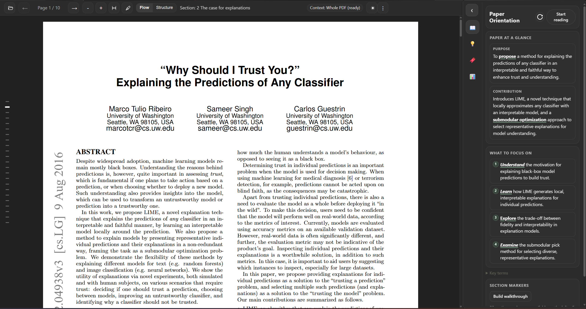
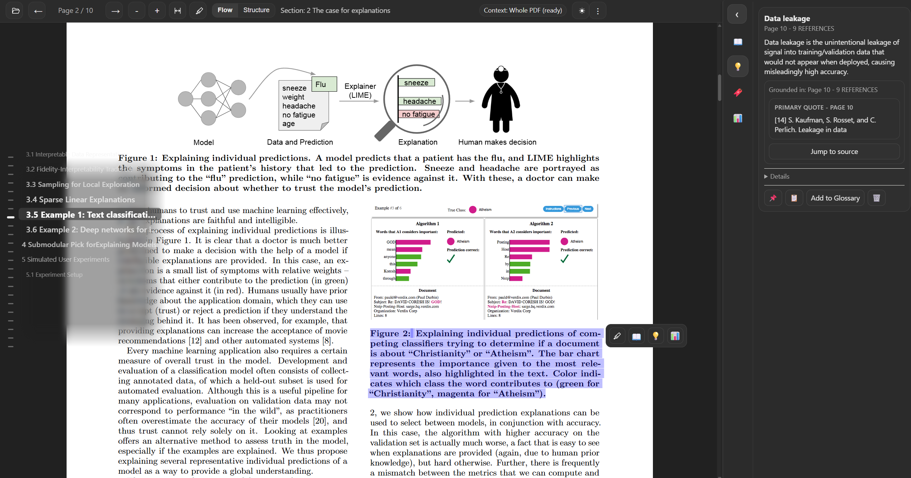

# CLARIFY 📚✨

> In-context PDF reading assistant for Chrome (Manifest V3)


CLARIFY opens PDFs in a custom viewer and helps you define terms, explain passages, translate figures, and build reading structure without leaving the document.

## ✨ Why CLARIFY

Reading research papers usually means constant context switching across tabs and tools. CLARIFY keeps assistance in the same PDF view and stores useful context per document.

## ✅ What It Does

- 📂 Opens local and remote PDFs in a custom PDF.js viewer.
- 🧪 Includes a project-centric Research Home for literature review workflows.
- 🖱️ Shows selection actions: `Highlight`, `Define`, `Explain`, `Translate (Figures)`.
- 🧭 Generates orientation summaries and section-level reading guidance.
- 💾 Stores per-document cards, glossary entries, walkthrough notes, and orientation cache.
- 📚 Stores project briefs, curated paper libraries, project-fit analyses, and comparison tables.
- 🎨 Supports light/dark themes, flow/structure reading modes, and diagnostics.
- 🤖 Supports `mock` and `OpenAI` LLM providers with fallback handling.

## 🚀 Quick Start

### 1. Load the extension

1. Open `chrome://extensions`.
2. Enable **Developer mode**.
3. Click **Load unpacked**.
4. Select this repository root (the folder with `manifest.json`).

### 2. Open CLARIFY viewer

Use one of these:

- Extension popup -> **Open Research Home**
- Extension popup -> **Open CLARIFY Viewer**
- Extension popup -> **Open current tab (if PDF)**
- Right-click a PDF link -> **Open PDF in CLARIFY**
- Viewer settings -> enable **Auto-open PDF links in CLARIFY**

### 3. Load a PDF

- Click the open-file icon in the viewer toolbar for a local PDF.
- Or open from a PDF URL via popup/context menu.

## 🧠 How To Use

### Research Home Quick Start

Research Home now uses a simple left-rail flow:

- Start screen: create a project, import a review, or reopen a recent project.
- `Discover`: search for candidate papers.
- `Screen`: make include/exclude/needs-info decisions.
- `Extract`: fill the literature matrix for included papers.
- `Insights`: compare included papers, then synthesize and map contribution space.

Recommended first run:

1. Click `Create project`.
2. Choose `Search papers`, `Add PDF / URL`, or `Import review`.
3. Review the screening queue and make one decision.
4. Open `Extract` and run matrix autofill.
5. Open `Insights` once you have at least two included papers.

Advanced controls live behind each page's `More` menu or the left-rail `Settings` button.
Use `How To` in the left rail for the compact checklist.

### Viewer Selection Actions

1. Select text inside the PDF.
2. Choose one action from the popover:
- `Highlight`
- `Define`
- `Explain`
- `Translate (Figures)`

### ⌨️ Viewer Keyboard Shortcuts

| Action | Windows/Linux | macOS |
| --- | --- | --- |
| Highlight selection | `Ctrl+Shift+H` | `Cmd+Shift+H` |
| Define selection | `Ctrl+Shift+D` | `Cmd+Shift+D` |
| Explain selection | `Ctrl+Shift+E` | `Cmd+Shift+E` |
| Translate figure/caption selection | `Ctrl+Shift+T` | `Cmd+Shift+T` |
| Dismiss selection UI | `Esc` | `Esc` |

### Viewer Sidebar Tabs

- 📘 `Orientation`: Purpose, contribution, focus bullets, key terms, reading map.
- 💡 `Explain`: Definition/explanation cards grounded to page/section snippets.
- 🔖 `Glossary`: Saved terms with one-line definitions and source context.
- 📊 `Figures`: Figure/table translation cards.
- 🧩 `Walkthrough`: Section-by-section one-liners for guided reading.

## ⚙️ Settings, LLM Modes, and Privacy

Open the 3-dot menu in the viewer toolbar.

### LLM modes

- `auto` (default): Uses OpenAI only when an API key is present; otherwise uses mock.
- `mock`: Deterministic local mock responses.
- `openai`: Uses OpenAI directly; requires API key.

### Context scope

- `selection`: Selected text + nearby context.
- `page`: Page-level context.
- `whole_pdf`: Uses uploaded PDF context (requires OpenAI key + upload enabled).

### Privacy notes

- 🔒 CLARIFY does not upload full documents by default.
- ✅ Whole-PDF behavior is explicit and opt-in.
- 🧾 OpenAI key is stored in extension local storage (`chrome.storage.local`).

## 🖼️ Screenshots





## 🛠️ Development

No build step is required.

1. Edit files directly.
2. Reload the extension in `chrome://extensions`.
3. Refresh any open CLARIFY viewer tab.

Debug entry points:

- Service worker logs: `chrome://extensions` -> **Inspect service worker**
- Viewer logs: DevTools in the viewer tab
- Debug bundle: Viewer menu -> **Copy debug info**

### Automated tests

Run the test suite with:

```bash
npm test
```

Live matrix-fill smoke test:

```bash
npm run test:live
```

Key behavior:

- Tests can read API keys from `.env` (`API_KEY` or `OPENAI_API_KEY`).
- Runtime extension behavior does **not** use `.env`; it uses the OpenAI key saved in Research Home settings (`chrome.storage.local`).

## 🧱 Repository Layout

```text
.
|-- manifest.json
|-- README.md
|-- assets/
|   `-- icons/
`-- src/
    |-- background/
    |   `-- service_worker.js
    |-- popup/
    |-- shared/
    |   |-- diagnostics.js
    |   |-- storage.js
    |   |-- settings_schema.js
    |   `-- llm/
    |       |-- index.js
    |       `-- providers/
    |-- vendor/
    |   `-- pdfjs/
    `-- viewer/
        |-- viewer.html
        |-- viewer.js
        |-- selection.js
        `-- mode_manager.js
```

## ⚠️ Known Limitations

- Some remote PDFs cannot be fetched due to CORS/auth restrictions.
- `file://` auto-redirect behavior can vary by browser settings.

## 🗺️ Roadmap Direction

- Better citation grounding controls
- Stronger document-level retrieval for long PDFs
- UX polish for orientation and walkthrough workflows
